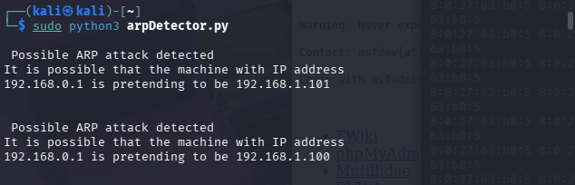

# Rilevatore di Attacchi ARP Spoofing

Prima di entrare nello specifico del codice, ecco una piccola digressione sull'ARP spoofing:

## ARP Spoofing
L'ARP spoofing è una tecnica di attacco informatico utilizzata nelle reti locali basate su IPv4. Permette a un malintenzionato di intercettare, modificare o bloccare il traffico dati in transito tra un dispositivo vittima e il gateway della rete o un altro host.

### Protocollo ARP
Il protocollo ARP ha il compito fondamentale di associare un indirizzo IP (logico) a un indirizzo MAC (fisico), consentendo ai dispositivi di comunicare all'interno di una stessa rete locale. Il protocollo è intrinsecamente insicuro poiché non prevede alcun meccanismo di autenticazione nativo: un dispositivo accetta risposte ARP anche se non le ha mai richieste.

### Funzionamento dell'attacco
Durante un attacco di ARP spoofing, l'aggressore invia messaggi ARP falsificati (ARP replies contraffatte) all'interno della LAN. In questo modo:
* Collega il proprio indirizzo MAC all'indirizzo IP del gateway o di un altro computer.
* Inganna i dispositivi della rete inducendoli a credere che il computer dell'attaccante sia il router legittimo.

<p align="center">
    
    
</p>
      
### Obiettivi
Una volta compiuto l'avvelenamento della cache ARP dei dispositivi coinvolti, l'attaccante può posizionarsi al centro della comunicazione, dando vita a uno scenario di tipo Man-in-the-Middle (MitM). I rischi principali includono:
* **Sniffing:** Intercettazione e lettura di dati sensibili (password, credenziali, cookie di sessione, traffico web non cifrato).
* **Session Hijacking:** Furto di sessioni di navigazione attive per impersonare l'utente.
* **Denial of Service (DoS):** Blocco o deviazione del traffico per impedire ai dispositivi di accedere alla rete o a Internet.
* **Data Modification:** Alterazione dei dati in transito o iniezione di codice/malware.

---

## Funzionamento del Rilevatore

Il programma crea una tabella ARP interna dinamica utilizzando un dizionario Python. Analizza i pacchetti in transito e mappa ogni nuovo indirizzo MAC al rispettivo IP. Successivamente, verifica se i nuovi pacchetti ricevuti tentano di sovrascrivere una di queste associazioni in modo anomalo. Se rileva che un MAC address già noto sta improvvisamente reclamando un indirizzo IP diverso, lo script suppone un'attività dannosa e fa scattare l'allarme.

Per fare ciò, il codice utilizza **Scapy**, una potente libreria Python per la manipolazione dei pacchetti di rete, sfruttando la sua funzione `sniff` per intercettare passivamente il traffico che attraversa la scheda di rete (NIC).


### Logica del Codice
Il cuore del programma si basa sulla funzione di callback `processPacket`, che viene eseguita per ogni pacchetto catturato. Di seguito i passaggi chiave:

1. **Intercettazione Mirata:** Sfruttando la funzione `sniff` di Scapy, il programma si mette in ascolto continuo (`count=0`) filtrando esclusivamente il traffico ARP (`filter="arp"`), ignorando il resto per ottimizzare le risorse.
2. **Estrazione dei Dati:** Da ogni pacchetto ARP in transito, lo script estrae l'indirizzo IP sorgente e il relativo indirizzo MAC sorgente.
3. **Analisi e Rilevamento:** 
   * Se il MAC address intercettato è già presente nel dizionario `IP_MAC_Map`, il programma verifica che l'IP associato corrisponda a quello salvato in precedenza.
   * Se l'IP è diverso, significa che quel MAC address sta tentando di spacciarsi per un altro dispositivo (come il gateway): viene immediatamente restituito un avviso a schermo.
4. **Registrazione:** Se il MAC address non è noto, viene aggiunto al dizionario con il suo rispettivo IP, costruendo dinamicamente la tabella di riferimento.

Ecco un estratto del blocco logico principale:

```python
def processPacket(packet):
    src_IP = packet['ARP'].psrc
    src_MAC = packet['Ether'].src
    
    # Se il MAC è già noto, controlla se l'IP è cambiato
    if src_MAC in IP_MAC_Map.keys():
        if IP_MAC_Map[src_MAC] != src_IP:
            old_IP = IP_MAC_Map.get(src_MAC, "unknown")
            return f"\n[!] Possibile attacco ARP! \nLa macchina {old_IP} sta fingendo di essere {src_IP}\n"
    # Se è un nuovo dispositivo, salvalo nel dizionario
    else:
        IP_MAC_Map[src_MAC] = src_IP

# Avvia l'intercettazione continua dei pacchetti ARP
sniff(count=0, filter="arp", store=0, prn=processPacket)

```

### Prerequisiti e Installazione
Per far funzionare lo script è necessario Python 3 e l'installazione di Scapy:
```bash
pip install scapy

```

### Dimostrazione
Ecco il risultato dello script in esecuzione durante un attacco ARP Spoofing:

<p align="center">
    
</p>
