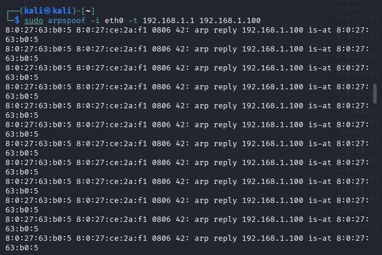
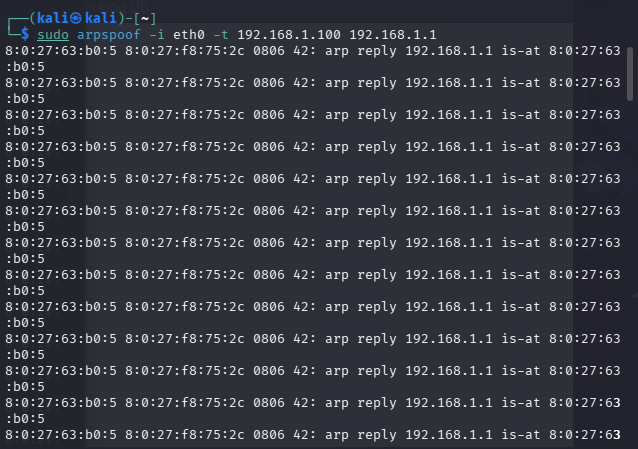

# Rilevatore-di-attacchi-ARP-spoofing
Prima di entrare nello specifico, una piccola digressione sull'ARP spoofing:

## ARP Spoofing
L'ARP spoofing è una tecnica di attacco informatico utilizzata nelle reti locali basate su IPv4.  Permette a un malintenzionato di intercettare, modificare o bloccare il traffico dati in transito tra un dispositivo vittima e il gateway della rete o un altro host.
---
### Protocollo ARP
Il protocollo ARP ha il compito fondamentale di associare un indirizzo IP (logico) a un indirizzo MAC (fisico), consentendo ai dispositivi di comunicare all'interno di una stessa rete locale. Il protocollo è intrinsecamente insicuro poiché non prevede alcun meccanismo di autenticazione nativo: un dispositivo accetta risposte ARP anche se non le ha mai richieste.
---
### Funzionamento dell'attacco
Durante un attacco di ARP spoofing, l'aggressore invia messaggi ARP falsificati (ARP replies contraffatte) all'interno della LAN. In questo modo:
* Collega il proprio indirizzo MAC all'indirizzo IP del gateway o di un altro computer.
* Inganna i dispositivi della rete inducendoli a credere che il computer dell'attaccante sia il router legittimo.

    
  </a>
    
  </a>

      
---
### Obiettivi
Una volta compiuto l'avvelenamento della cache ARP dei dispositivi coinvolti, l'attaccante può posizionarsi al centro della comunicazione, dando vita a uno scenario di tipo Man-in-the-Middle (MitM). I rischi principali includono:
* Sniffing: Intercettazione e lettura di dati sensibili (password, credenziali, cookie di sessione, traffico web non cifrato).
* Session Hijacking: Furto di sessioni di navigazione attive per impersonare l'utente.
* Denial of Service (DoS): Blocco o deviazione del traffico per impedire ai dispositivi di accedere alla rete o a Internet.
* Data Modification: Alterazione dei dati in transito o iniezione di codice/malware.

